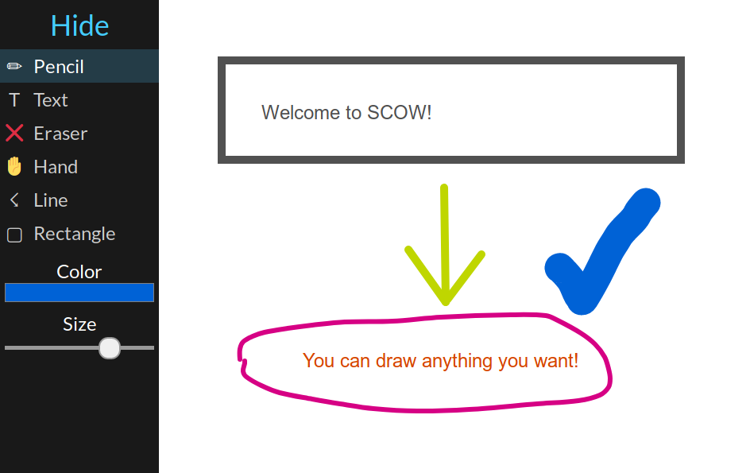

# SCOW

SCOW is a free, **S**imple, **C**ollaborative **O**nline **W**hiteboard and
a fork of [whitebophir][whitebophir]

Multiple users can use the time whiteboard and write text or draw
collaboratively in realtime.

## Running

Just clone the repository and run `npm install; npm start`!

## Screenshots

[whitebophir]: https://github.com/lovasoa/whitebophir
